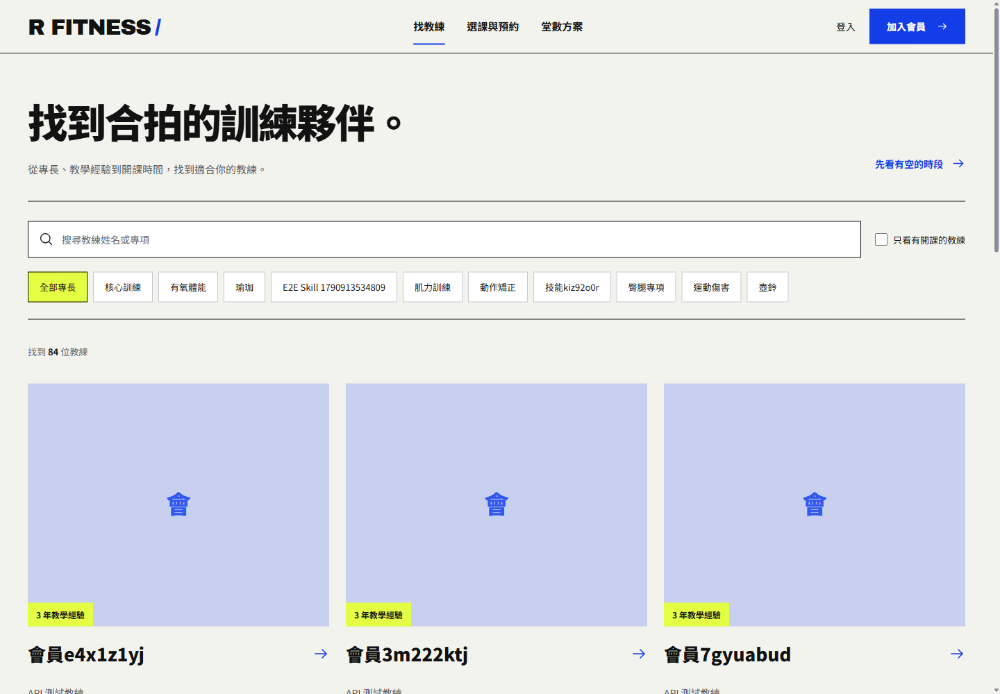
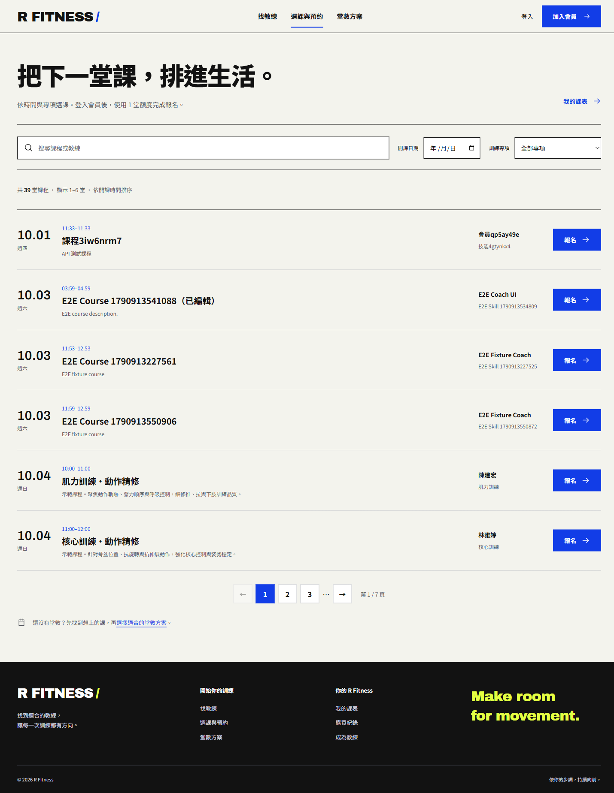
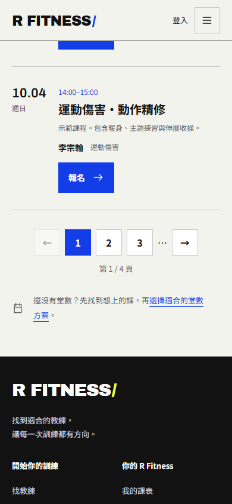

# R Fitness

一個讓會員購買堂數、預約課程，並讓教練管理課程與檢視月營收的全端健身課程平台。

**技術亮點：** 以 Node.js／Express／PostgreSQL 實作 RESTful API 與 JWT 授權；以 React／TypeScript 建構雙角色介面；以 Docker Compose、OpenAPI、Jest + Supertest contract tests 與 Playwright E2E 驗證交付品質。

## 線上體驗

**[開啟 R Fitness 展示網站](https://r-fitness-web.onrender.com/)** · [3 分鐘專案介紹](docs/project-presentation.md) · [API 健康檢查](https://r-fitness-api.onrender.com/healthcheck)

不需安裝即可操作。建議先以會員帳號體驗預約，再切換教練帳號查看課程管理與營收報表。

| 身分 | 示範帳號 | 密碼 |
| --- | --- | --- |
| 會員 | demo.member1@example.com | Demo12345 |
| 教練 | chen.jianhong@rfitness.tw | Demo12345 |

### 找教練 → 選課 → 預約

1. **登入會員**：點選「登入」，使用上方會員帳號；可先開啟「我的課表」記下剩餘堂數。
2. **找教練**：進入「找教練」，查看專長與教練介紹，開啟教練頁面瀏覽課程。
3. **選課**：也可到「選課與預約」，使用課程／教練搜尋、開課日期或訓練專項篩選。每頁顯示 6 堂課，可用頁碼繼續瀏覽。
4. **完成預約**：選一堂尚未報名的未來課程，點「報名」並確認。成功後扣除 1 堂額度，點「查看我的課表」確認紀錄。
5. **體驗取消**：在「我的課表」找到剛才的課程，選「取消報名」並確認，剩餘額度會增加 1 堂。取消紀錄會保留；同一帳號不能重新報名曾取消的同一堂課，再次體驗請選另一堂。

若額度不足，進入「堂數方案」點「購買方案」並確認，再返回選課。**付款為模擬流程：只建立購買紀錄與堂數額度，未串接金流，不需信用卡，也不會真實扣款。**

教練體驗：登出會員後，使用教練帳號登入，查看課程管理與「營收報表」。報表依有效報名筆數與方案平均單堂價格計算，屬於展示用估算，並非金流實收。

公開帳號與資料供多人共用；若出現「已經報名過此課程」，請換一堂課，或自行註冊展示帳號。請勿輸入個人敏感資料。

目前使用 Render 免費方案；API 閒置後首次載入可能需要約一分鐘。現有雲端資料庫將於 **2026-10-16** 到期，長期展示前需升級或搬移資料庫。詳細設定見 [部署指南](docs/demo-and-deployment.md)。

## 畫面預覽

以下為本機網站於 2026-10-01 的實際截圖，使用展示資料。品牌圖片為生成素材，來源見 [圖片說明](frontend/public/assets/editorial/PROVENANCE.md)。


<details>
<summary>找教練與分頁課表</summary>







</details>

## 功能一覽

| 使用者 | 可完成的流程 | 技術／商業規則 |
| --- | --- | --- |
| 訪客 | 瀏覽教練、課程與堂數方案 | 公開 API、分頁與角色導向頁面 |
| 會員（User） | 註冊登入、購買堂數、報名／取消課程、查看課表 | JWT、剩餘堂數即時計算、取消軟刪除 |
| 教練（Coach） | 維護個人檔案與技能、開設／修改課程、查看月營收 | 角色授權、課程所有權檢查、SQL 聚合、Recharts |

### 核心商業規則

- 報名會依序檢查：課程存在、是否曾報名、剩餘堂數與課程名額。
- 取消報名採軟刪除；紀錄保留，且堂數會由即時計算自動回補。
- 剩餘堂數不儲存於資料庫，公式為「購買總堂數 − 未取消報名數」。
- 教練營收排除取消報名，並依所有方案的平均單堂價格計算。

## 架構與技術棧

```text
React 19 + TypeScript + Vite
        │ Axios / JWT
        ▼
Node.js + Express 5 ── TypeORM ── PostgreSQL
        │
        ├── OpenAPI / Swagger UI
        ├── Jest + Supertest API contract tests
        └── Playwright E2E tests
```

| 區域 | 語言、框架與主要套件 |
| --- | --- |
| 前端 | TypeScript、React 19、Vite、React Router、Tailwind CSS 4、Axios、Recharts、GSAP、SweetAlert2、Day.js、jwt-decode |
| 後端 | JavaScript、Node.js 20、Express 5、TypeORM、pg、bcrypt、jsonwebtoken、CORS、dotenv |
| 資料庫／基礎設施 | PostgreSQL（本機／CI：16；Render 展示：18）、Docker、Docker Compose、Swagger UI |
| 品質保證 | Jest、Supertest、Playwright、GitHub Actions、TypeScript 型別檢查 |

## 本機啟動

### 展示資料與部署

啟動獨立展示資料庫並安裝後端依賴後，執行 `npm run seed:demo`，即可建立示範教練、會員、未來課程，以及今年 1 月至本月的歷史報名與營收資料。同日重跑不會重複新增，但會更新腳本管理的示範紀錄，請勿對正式會員資料庫執行。

API 啟動後執行 `npm run verify:demo` 驗證每位教練的逐月報表。示範帳號見頁首；seed 會將示範會員密碼設為 `DEMO_PASSWORD`（預設 `Demo12345`），既有教練密碼不變。

完整操作、資料口徑與 Render 前後端／PostgreSQL 部署設定：[展示資料與部署指南](docs/demo-and-deployment.md)。

### 目前展示環境：一個指令啟動

本機既有 `fitness` 資料庫、Docker Desktop 與前後端依賴已安裝時，在專案根目錄執行：

```bash
npm run dev:local
```

此指令啟動既有 `node-js-final-2026-postgres-1` 容器，確認資料庫可用後啟動 API（8080）與前端（5174）。服務在背景執行，已運行的服務會沿用。它不會重置資料、加入測試資料或自動同步資料表結構；失敗時會列出本機紀錄檔位置。Docker Desktop 必須先開啟。

展示網址：http://127.0.0.1:5174/ 。需要寫入資料的端對端測試請使用獨立測試資料庫，避免將 `E2E` 資料重新加入展示環境。

### 方式 A：完整 Docker 環境

需求：Docker Desktop。

先將 `.env.example` 複製為根目錄 `.env`，並將 `JWT_SECRET` 設為隨機字串（可用 `node -e "console.log(require('crypto').randomBytes(32).toString('hex'))"` 產生）。已有 `.env` 時直接更新設定，避免覆蓋。Compose 會在未提供簽章密鑰時停止啟動；根目錄 `.env` 不納入版本控制。

```bash
docker compose up --build
```

| 服務 | 網址／連線資訊 |
| --- | --- |
| 前端 | http://localhost:3000 |
| 後端 API | http://localhost:8080 |
| Swagger UI | http://localhost:8081 |
| PostgreSQL | `localhost:5433`（容器內為 5432） |

停止服務使用 `docker compose down`。若需要重建資料庫，使用 `npm run db:reset`；這會移除 Docker volume 中既有資料。

### 方式 B：本機開發（前後端分開啟動）

需求：Node.js 20+、Docker Desktop。

```bash
# 終端機 1：只啟動資料庫與 API 文件
docker compose up -d postgres swagger

# 終端機 2：啟動後端
Copy-Item .env.example backend/.env
npm ci --prefix backend
npm --prefix backend run dev

# 終端機 3：啟動前端
Copy-Item frontend/.env.example frontend/.env
npm ci --prefix frontend
npm --prefix frontend run dev
```

`.env.example` 的 `DB_PORT=5433` 是給本機後端連 Docker PostgreSQL 使用；完整 Docker 環境的後端則使用容器內的 `DB_PORT=5432`。

## 測試與驗證

### 完整回歸與乾淨安裝

Docker Desktop 開啟後，在專案根目錄執行：

```bash
npm run verify:clean
```

指令會把目前原始碼（含尚未提交的修改）複製到新的系統暫存資料夾，不帶入 `.env`、`node_modules` 或既有建置檔。接著依三份 lockfile 分別執行 `npm ci`，使用獨立、空白的 PostgreSQL 16 測試容器與自動配置的本機埠，完成後端合約測試、重啟保存檢查、型別檢查、建置、開發版與正式建置版瀏覽器測試。

測試自行建立帳號、方案與課程，不需要先執行 seed，也不會連線到展示用的 5433／8080。結束後會停止並移除本次測試容器；原始碼快照、安裝記錄、測試結果與 `report.json` 保留在輸出顯示的暫存資料夾，方便追查失敗。需要網路下載依賴、Docker 映像與 Playwright Chromium。

前端以頁面分割 JavaScript；首頁不預先下載教練營收圖表。正式建置測試另外涵蓋延遲下載時的載入提示、導覽列、直接開啟分頁與重新整理，以及 320／768／1024／1440px 的水平溢出檢查。腳本會檢查每個 JavaScript 區塊不超過 500 kB。憑證攔截器的來源模組測試只在開發版執行，其餘使用者流程也會在正式建置版執行。

### 分開執行（請指向獨立測試資料庫）

```bash
# 後端 API contract tests（需先啟動後端與 PostgreSQL）
npm test

# 前端型別檢查與 production build
npm --prefix frontend run build

# 前端端對端測試（需先啟動後端與 PostgreSQL）
npm --prefix frontend run test:e2e:types
npm --prefix frontend run test:e2e
```

GitHub Actions 在推送至 `main` 時會啟動 PostgreSQL、建置前後端，並執行前端型別檢查與 Playwright E2E。

## API 與存取控制

- OpenAPI 規格：[docs/openapi.yaml](docs/openapi.yaml)；完整 Docker 環境可在 Swagger UI 試打。
- 寫入會員資料、購買方案、報名與取消課程都需要 JWT。
- 教練後台、技能與方案管理需要 JWT 與 Coach 角色；教練只能讀寫自己的課程與資料。
- 升級教練使用 `POST /api/users/me/coach`，由登入 token 取得本人身分，不能指定或升級其他帳號。

後端連線會將 PostgreSQL session 時區設為 Node 執行環境的時區，使無時區 timestamp 欄位的預設建立時間與報表月份一致。部署時應固定 Node 的 `TZ`（本機回歸環境使用 `Asia/Taipei`）；此設定不會自動轉換既有歷史資料。

## 專案文件

- [3 分鐘專案介紹與展示順序](docs/project-presentation.md)
- [線上展示、示範帳號與部署指南](docs/demo-and-deployment.md)
- [完整回歸與載入效能紀錄](docs/verification-2026-10-01.md)
- [領域詞彙與關係](CONTEXT.md)：User、Coach、CourseBooking 等名詞與資料關係。
- [OpenAPI 規格](docs/openapi.yaml)：請求／回應格式與驗證規則。
